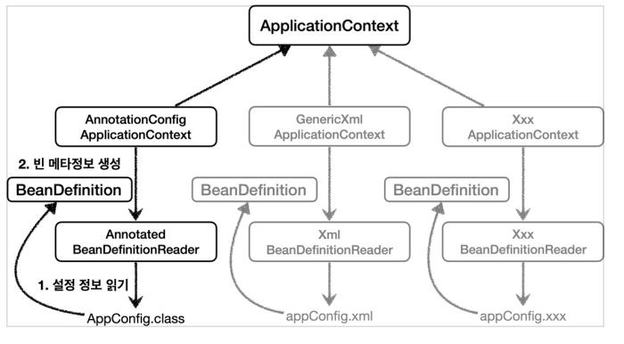
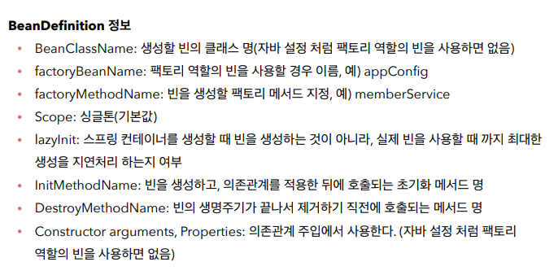
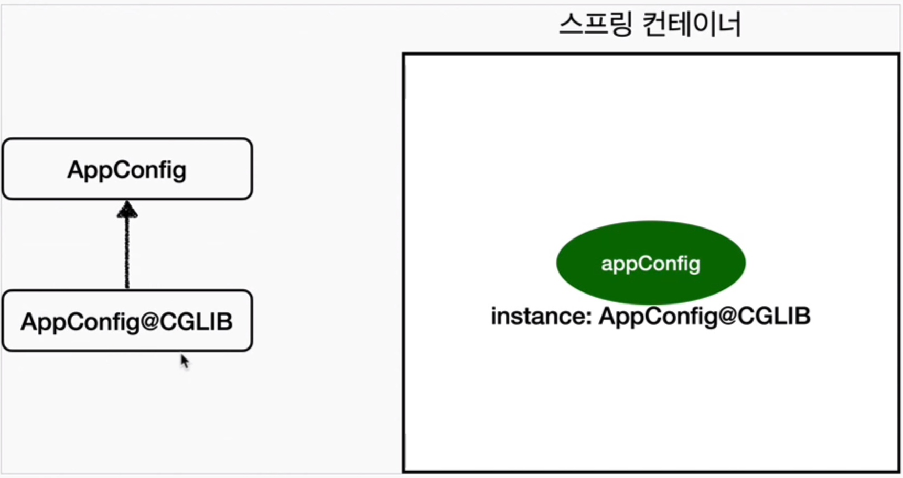

# Spring 기초


### 1. Spring Container 생성 과정

```java
ApplicationContext applicationContext = new 				
    								AnnotationConfigApplicationContext(AppConfig.class)
```

* 해당 `Application Context`를 스프링 컨테이너라고 하며, 이는 interface다.
  * XML 기반 or Annotation기반의 자바 설정 클래스 등의 구현체가 존재한다.


1. Spring Container 생성
   * new AnnotationConfigApplciationContext(AppConfig.class) 
   * 구성 정보를 지정해주어야 한다 ex) AppConfig.class

2. Spring Bean 등록
   * @Bean 어노테이션이 붙은 클래스들을 스프링 빈을 등록한다.
   * 빈 이름을 직접 부여할 수 있다. (default = ${method name})
   * bean name이 중복되지 않도록 주의하여야 한다.
3. Spring Bean 의존관계 설정 
   * 준비
   * 완료
4. 스프링 컨테이너는 설정 정보를 참고해서 DI를 수행한다.
   * Bean의 의존성 정보 참고

```
스프링은 빈을 생성하고 의존관계를 주입하는 단계가 나누어져 있다. 
하지만 자바 코드로 스프링 빈을 등록하면 생성자를 호출하면서 의존관게 주입도 한번에 처리된다.
```


### ApplicationContext 생성 및 접근

```java
// AppConfig.class

package com.basic.spring;

import org.springframework.context.annotation.Bean;
import org.springframework.context.annotation.Configuration;

@Configuration
public class AppConfig {

    @Bean
    public TestService testService() {
        return new TestService(testRepository());
    }

    @Bean
    public TestRepository testRepository() {
        return new TestRepository();
    }
}
```

```java
package com.basic.spring.beanfind;

import com.basic.spring.AppConfig;
import org.junit.jupiter.api.DisplayName;
import org.junit.jupiter.api.Test;
import org.springframework.context.ApplicationContext;
import org.springframework.context.annotation.AnnotationConfigApplicationContext;

public class ApplicationContextInfoTest {

    ApplicationContext applicationContext = new AnnotationConfigApplicationContext(AppConfig.class);

    @Test
    @DisplayName("모든 빈 출력하기")
    void findAllBean() {
        String[] beanDefinitionNames = applicationContext.getBeanDefinitionNames();
        for (String beanDefinitionName: beanDefinitionNames) {
            Object bean = applicationContext.getBean(beanDefinitionName);
            System.out.println("name = " + beanDefinitionName + " object = " + bean);
        }
    }
    
    
}
```

```java
name = org.springframework.context.annotation.internalConfigurationAnnotationProcessor object = org.springframework.context.annotation.ConfigurationClassPostProcessor@3301500b
name = org.springframework.context.annotation.internalAutowiredAnnotationProcessor object = org.springframework.beans.factory.annotation.AutowiredAnnotationBeanPostProcessor@24b52d3e
name = org.springframework.context.annotation.internalCommonAnnotationProcessor object = org.springframework.context.annotation.CommonAnnotationBeanPostProcessor@15deb1dc
name = org.springframework.context.event.internalEventListenerProcessor object = org.springframework.context.event.EventListenerMethodProcessor@6e9c413e
name = org.springframework.context.event.internalEventListenerFactory object = org.springframework.context.event.DefaultEventListenerFactory@57a4d5ee
name = appConfig object = com.basic.spring.AppConfig$$EnhancerBySpringCGLIB$$2c5ede4c@5af5def9
name = testService object = com.basic.spring.TestService@3a45c42a
name = testRepository object = com.basic.spring.TestRepository@36dce7ed

```


### 스프링 빈 조회 - 상속관계

* 부모 타입으로 조회하면, 자식 타입도 함께 조회한다.
* 따라서 Object 타입으로 조회하면 모든 스프링빈을 조회한다. 


### BeanDefinition - Spring Bean 설정 메타정보

- 스프링이 다양한 설정 형식을 지원하는 데에는 BeanDefinition이라는 추상화가 있다.
  * 이는 역할과 구현을 개념적으로 나눈것으로, 스프링 컨테이너는 자바 코드인지 XML인지 몰라도 이를 읽어서 오직 BeanDefinition만 만들면 된다.

- Bean Definition은 빈 설정 메타정보로, @Bean, <Bean> 당 하나의 메타 정보가 생성된다.

- 스프링 컨테이너는 이를 기반으로 스프링 빈을 생성한다.



- AnnotationConfigApplicationContext는 AnnotatedBeanDefinitionReader를 이용해 AppConfig.class를 읽고, BeanDefinition을 생성한다.

* XML 기반 클래스도 위와 같은 과정을 통해 BeanDefinition을 만든다.




### Singleton Pattern

* 


#### @Configuration과 바이트코드 조작

* 스프링 컨테이너는 싱글톤 레지스트리이므로 Spring Bean이 싱글톤이 되도록 보장해주어야 한다.
* 따라서 @Configuration 어노테이션이 포함된 클래스에 존재하는 @Bean들은 CGLIB을 이용한 바이트 코드 조작을 통해 프록시 Config 객체를 생성하여 만약 해당 클래스가 Bean에 등록되어 있다면 그대로 반환하고 등록되지 않았다면 해당 클래스의 인스턴스를 생성하고 빈에 등록하는 과정을 거친다.



``` java
// 예상 AppConfig@CGLIB 내부 동작 로직
@Bean
public MemberRepository proxyMemberRepository() {
    if (ApplicationContext contains memberRepository) {
        return ApplicationContext.getMemberRepository;
    } else {
		memberRepository(); // AppConfig 의 기존 로직을 호출하여 MemberRepository를 생성하고 스프링 컨테이너에 등록
    }
}
```


#### `@Configuration`을 적용하지 않고 `@Bean`만 적용한다면?

해당 클래스가 Bean에 등록되지만 싱글톤을 보장하지 않는다.


### ComponentScan

```java
// Auto App Config

@Configuration
@ComponentScan(
	excludeFilters = @ComponentScan.Filter(type = FilterType.ANNOTATION, classes = Configuration.class)
)
public class AutoAppConfig {
    
}
```

* 이 때, @Configuration 내부에도 @Component 어노테이션이 포함되어 있기 때문에 제외해줘야한다.


#### 탐색 위치와 컴포넌트 

```java
@ComponentScan(
	basePackages = "com.basic.spring"
)
```

* `basePackages`: 탐색할 패키지의 시작 위치를 지정한다. 이 패키지를 포함해서 하위 패키지를 모두 탐색한다.
  * 모든 코드를 탐색하지 않고 빠르게 필요한 부분만 탐색 할 수 있다.
  * 멀티 모듈 프로젝트의 경우 `	basePackages = {"com.basic", "com.advanced"}`이런 방식으로 다른 모듈의 package들을 가져올 수 있다.
* `basePackageClasses`: 지정한 클래스의 패키지를 탐색 시작 위치로 지정한다.
* 만약 지정하지 않으면 `@ComponentScan`이 붙은 설정 정보 클래스의 패키지가 시작 위치가 된다.

